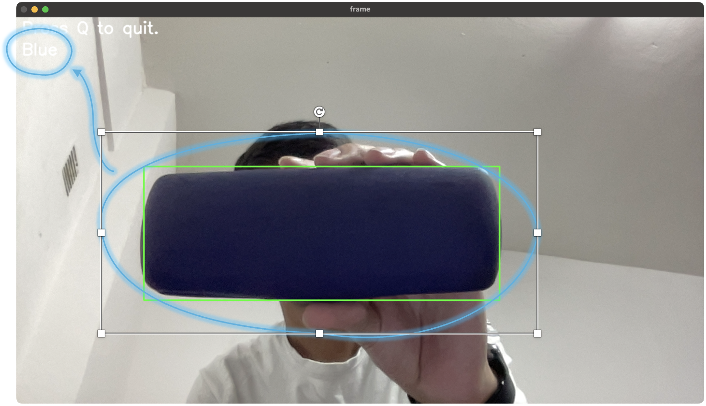

# ColorBasedObjectDetection

A real-time computer vision application that detects, tracks, and analyzes specific colors from a video feed using OpenCV. This project simplifies color measurement and object tracking for educational and hobbyist purposes.




## 🚀 Quick Start

```bash
# Install dependencies
pip install -r requirements.txt

# Run the application
python code/main.py
```

## ✨ Features

### Detection Logic

- **HSV Conversion**: Accurate color segmentation by converting frames to HSV space.
- **Hue Thresholding**: Calculates dynamic limits to isolate specific colors reliably.
- **Contour Filtering**: Area-based noise suppression to ignore small, irrelevant objects.

### Tracking Capabilities

- **Bounding Boxes**: Real-time visual tracking with green borders around detected targets.
- **Color Identification**: Automatic naming of detected colors (Red, Blue, Yellow, etc.).
- **Smooth Feed**: Low-latency video processing for continuous real-time execution.

### Interactive Tools

- **RGB Sampling**: Left-click any pixel to view its precise RGB value in real-time.
- **Dynamic Highlighting**: Visual indicators at clicked positions for precise sampling.
- **Parametric Input**: Terminal-based BGR specification before the main loop starts.

## 📖 Usage

1. Launch the script via terminal
2. Enter the target color's BGR values when prompted (e.g., `0 0 255` for Red)
3. Point your camera at objects matching the specified color
4. View the live tracking and color name labels
5. Left-click anywhere on the frame to sample live RGB data

---

> **Note:** Performance may vary based on environmental lighting conditions and camera sensor quality.
